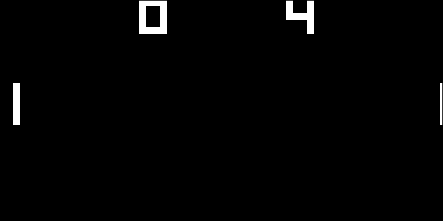
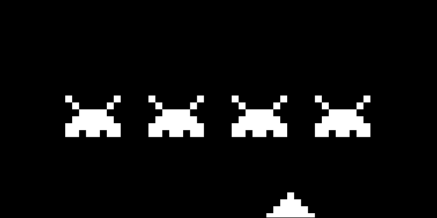
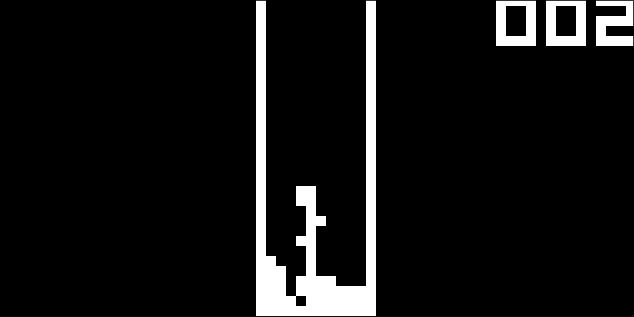

# silicon8 🖥️

> A cycle-accurate CHIP-8 emulator written in C using SDL2 — built from the silicon up.

---

## Table of Contents

- [What is CHIP-8?](#what-is-chip-8)
- [What is silicon8?](#what-is-silicon8)
- [Architecture Overview](#architecture-overview)
  - [Memory Layout](#memory-layout)
  - [Registers](#registers)
  - [The Stack](#the-stack)
  - [Timers](#timers)
  - [Display](#display)
  - [Input](#input)
- [Instruction Set](#instruction-set)
- [How the Emulator Loop Works](#how-the-emulator-loop-works)
  - [Fetch](#fetch)
  - [Decode & Execute](#decode--execute)
  - [Render](#render)
- [Sprite Drawing & Collision Detection](#sprite-drawing--collision-detection)
- [Prerequisites](#prerequisites)
- [Building from Source](#building-from-source)
- [Running a ROM](#running-a-rom)
- [Key Mapping](#key-mapping)
- [Project Structure](#project-structure)
- [Known Limitations & Future Work](#known-limitations--future-work)
- [Resources for Further Reading](#resources-for-further-reading)

---

## What is CHIP-8?

CHIP-8 is an **interpreted programming language** developed in the mid-1970s by Joseph Weisbecker for the COSMAC VIP microcomputer. It was designed to allow video games to be written more easily for 8-bit machines of that era.

Despite being half a century old, CHIP-8 remains one of the most popular targets for emulator developers because:

- Its specification is **compact and well-documented** — only 35 opcodes.
- It exercises all the core concepts of emulation: memory, registers, a stack, timers, graphics, and input.
- ROMs are freely available and small (at most 3.5 KB).

A CHIP-8 "emulator" is technically an **interpreter** — it reads CHIP-8 bytecode and executes it on your modern hardware, faithfully mimicking how the original interpreter would have behaved.

---

## What is silicon8?

**silicon8** is a clean, single-file CHIP-8 emulator written in **C99**, using **SDL2** for windowing, rendering, and input. It is designed to be:

- **Readable** — the source is organized so that each part of the CHIP-8 specification maps clearly to a function or code block.
- **Correct** — it implements all 35 standard CHIP-8 opcodes including arithmetic, logic, flow control, memory, and graphics.
- **Self-contained** — aside from SDL2, it has zero external dependencies.

If you want to learn how emulators work at a foundational level, this codebase is a great starting point.

---

## Architecture Overview

CHIP-8 defines a small, fixed virtual machine. Here is a breakdown of every component silicon8 emulates:

### Memory Layout

```
0x000 – 0x04F  : Reserved (historically for the interpreter itself)
0x050 – 0x09F  : Font data (built-in 4×5 pixel sprites for hex digits 0–F)
0x200 – 0xFFF  : ROM / Program space (your game is loaded here)
```

Total addressable memory: **4096 bytes (4 KB)**

In silicon8, `chip->memory` is a flat `uint8_t[4096]` array. The font set is copied into `0x050` at startup. ROM data is loaded starting at `0x200`, which is where the program counter (`pc`) also begins.

---

### Registers

CHIP-8 has **16 general-purpose 8-bit registers**, named `V0` through `VF`.

| Register | Purpose |
|---|---|
| `V0`–`VE` | General-purpose data storage |
| `VF` | Flag register — used to report carry, borrow, and collision results. **Do not use as a general register.** |

There is also:
- **`I`** — a 16-bit *index register* used to point to memory addresses, primarily for reading sprite data and storing/loading registers.
- **`PC`** — the 16-bit *program counter*, always pointing to the next instruction to execute.

---

### The Stack

CHIP-8 supports **subroutine calls** via a dedicated 16-level stack. When `CALL` (`2NNN`) is executed, the current `PC` is pushed onto the stack and `PC` is set to `NNN`. When `RET` (`00EE`) is executed, `PC` is popped back off.

In silicon8:
```c
uint16_t stack[16];
uint8_t  sp;       // Stack pointer, starts at 0
```

`sp` acts as an index into the `stack` array. It is **pre-decremented on pop** and **post-incremented on push**, which is a common and idiomatic pattern.

---

### Timers

CHIP-8 has two special 8-bit countdown timers, both decrementing at **60 Hz** (once per frame) until they reach zero:

| Timer | Behaviour |
|---|---|
| `delay_timer` | General-purpose timing. Games read this to measure elapsed time. |
| `sound_timer` | When non-zero, a beep should sound. silicon8 does not currently implement audio output. |

In the main loop, timers are decremented on a 60 Hz interval tracked using `SDL_GetTicks()`.

---

### Display

The CHIP-8 display is a **64 × 32 pixel monochrome** screen. Each pixel is either on (1) or off (0).

In silicon8, this is stored as a flat `uint8_t[64 * 32]` array:
```c
uint8_t display[DISPLAY_WIDTH * DISPLAY_HEIGHT];
```

Pixel `(x, y)` maps to `display[y * 64 + x]`.

The window itself is rendered at **10× scale** (640 × 320 pixels) using SDL2 `SDL_RenderFillRect`. Each logical pixel becomes a 10×10 filled rectangle.

---

### Input

CHIP-8 was designed for a **16-key hexadecimal keypad** (keys `0`–`F`). silicon8 maps this to a standard QWERTY keyboard:

```
CHIP-8 Keypad       Keyboard Mapping
┌───┬───┬───┬───┐   ┌───┬───┬───┬───┐
│ 1 │ 2 │ 3 │ C │   │ 1 │ 2 │ 3 │ 4 │
├───┼───┼───┼───┤   ├───┼───┼───┼───┤
│ 4 │ 5 │ 6 │ D │   │ Q │ W │ E │ R │
├───┼───┼───┼───┤   ├───┼───┼───┼───┤
│ 7 │ 8 │ 9 │ E │   │ A │ S │ D │ F │
├───┼───┼───┼───┤   ├───┼───┼───┼───┤
│ A │ 0 │ B │ F │   │ Z │ X │ C │ V │
└───┴───┴───┴───┘   └───┴───┴───┴───┘
```

Each key's state (pressed `1` / released `0`) is stored in `chip->keypad[0x0]` through `chip->keypad[0xF]`.

---

## Instruction Set

CHIP-8 opcodes are always **2 bytes wide** and are stored big-endian. The first nibble (4 bits) identifies the opcode family. Here is a summary of every opcode silicon8 implements:

| Opcode | Mnemonic | Description |
|---|---|---|
| `00E0` | CLS | Clear the display |
| `00EE` | RET | Return from subroutine |
| `1NNN` | JP NNN | Jump to address NNN |
| `2NNN` | CALL NNN | Call subroutine at NNN |
| `3XNN` | SE Vx, NN | Skip next if Vx == NN |
| `4XNN` | SNE Vx, NN | Skip next if Vx != NN |
| `5XY0` | SE Vx, Vy | Skip next if Vx == Vy |
| `6XNN` | LD Vx, NN | Set Vx = NN |
| `7XNN` | ADD Vx, NN | Set Vx = Vx + NN (no carry) |
| `8XY0` | LD Vx, Vy | Set Vx = Vy |
| `8XY1` | OR Vx, Vy | Set Vx = Vx OR Vy |
| `8XY2` | AND Vx, Vy | Set Vx = Vx AND Vy |
| `8XY3` | XOR Vx, Vy | Set Vx = Vx XOR Vy |
| `8XY4` | ADD Vx, Vy | Set Vx = Vx + Vy; VF = carry |
| `8XY5` | SUB Vx, Vy | Set Vx = Vx - Vy; VF = NOT borrow |
| `8XY6` | SHR Vx | Shift Vx right 1; VF = bit shifted out |
| `8XY7` | SUBN Vx, Vy | Set Vx = Vy - Vx; VF = NOT borrow |
| `8XYE` | SHL Vx | Shift Vx left 1; VF = bit shifted out |
| `9XY0` | SNE Vx, Vy | Skip next if Vx != Vy |
| `ANNN` | LD I, NNN | Set I = NNN |
| `BNNN` | JP V0, NNN | Jump to NNN + V0 |
| `CXNN` | RND Vx, NN | Set Vx = random byte AND NN |
| `DXYN` | DRW Vx, Vy, N | Draw N-byte sprite at (Vx, Vy); VF = collision |
| `EX9E` | SKP Vx | Skip if key Vx is pressed |
| `EXA1` | SKNP Vx | Skip if key Vx is NOT pressed |
| `FX07` | LD Vx, DT | Set Vx = delay timer |
| `FX0A` | LD Vx, K | Wait for key press, store in Vx |
| `FX15` | LD DT, Vx | Set delay timer = Vx |
| `FX18` | LD ST, Vx | Set sound timer = Vx |
| `FX1E` | ADD I, Vx | Set I = I + Vx |
| `FX29` | LD F, Vx | Set I = address of sprite for digit Vx |
| `FX33` | LD B, Vx | Store BCD representation of Vx at I, I+1, I+2 |
| `FX55` | LD [I], Vx | Store V0–Vx in memory starting at I |
| `FX65` | LD Vx, [I] | Read V0–Vx from memory starting at I |

> **BCD** (Binary-Coded Decimal): `FX33` splits a byte (0–255) into its three decimal digits and stores each separately. For example, `0xAB` (171) stores `1`, `7`, `1` at addresses `I`, `I+1`, `I+2`.

---

## How the Emulator Loop Works

The heart of silicon8 is a standard **fetch → decode → execute → render** loop running at approximately 60 FPS.

```
┌─────────────────────────────────────────────┐
│                  Main Loop                  │
│                                             │
│  1. Poll SDL events (keyboard, quit)        │
│                                             │
│  2. Execute 10 CPU cycles:                  │
│     ┌─────────────────────────────────┐     │
│     │  Fetch   → Read 2 bytes at PC   │     │
│     │  PC += 2                        │     │
│     │  Decode  → Extract nibbles      │     │
│     │  Execute → Dispatch opcode      │     │
│     └─────────────────────────────────┘     │
│                                             │
│  3. Decrement delay/sound timers (60 Hz)    │
│                                             │
│  4. Render display to SDL window            │
│                                             │
│  5. Delay to cap at ~60 FPS                 │
└─────────────────────────────────────────────┘
```

### Fetch

```c
uint16_t opcode = (chip->memory[chip->pc] << 8) | chip->memory[chip->pc + 1];
chip->pc += 2;
```

Two consecutive bytes are read from memory and combined into a single 16-bit opcode. The program counter advances by 2 after every fetch.

### Decode & Execute

The `emulate()` function uses a `switch` on the top nibble (`opcode & 0xF000`) to dispatch to the correct handler. From the opcode, four fields are always pre-decoded:

```c
uint8_t  x   = (opcode & 0x0F00) >> 8;  // Register index X
uint8_t  y   = (opcode & 0x00F0) >> 4;  // Register index Y
uint8_t  n   = (opcode & 0x000F);       // 4-bit constant
uint8_t  nn  = (opcode & 0x00FF);       // 8-bit constant
uint16_t nnn = (opcode & 0x0FFF);       // 12-bit address
```

Not every opcode uses every field — the relevant ones are simply used when needed.

### Render

`render_display()` iterates over the 64 × 32 pixel array. For each pixel that is `1`, it draws a 10 × 10 filled rectangle at the corresponding scaled position in the SDL window.

---

## Sprite Drawing & Collision Detection

The `DRW` instruction is the most complex in CHIP-8. Here is how `draw_sprite()` works:

1. The sprite to draw is `N` bytes tall and always 8 pixels wide.
2. Sprite bytes are read sequentially from `memory[I]` to `memory[I + N - 1]`.
3. Each bit in a sprite byte represents one pixel, from the **most significant bit (leftmost)** to the **least significant bit (rightmost)**.
4. Pixels are **XORed** onto the display — this means drawing over an existing pixel turns it off.
5. If any pixel was **erased** (i.e., a 1 was XORed with a 1), `VF` is set to `1` (collision). Otherwise `VF` is `0`.
6. Drawing clips at the screen boundary — pixels that would fall outside the 64 × 32 grid are simply not drawn (no wrapping of the sprite body).

```
Sprite byte: 0xF0 = 1111 0000

Rendered as:
█ █ █ █ · · · ·
```

This mechanism is what CHIP-8 games use to detect when objects on screen overlap — for example, when a ball hits a brick in Breakout.

---

## Prerequisites

Before building silicon8, ensure you have the following installed:

| Dependency | Notes |
|---|---|
| A C compiler | `gcc` or `clang`, supporting at least C99 |
| SDL2 development libraries | Provides windowing, rendering, and event handling |
| `make` (optional) | If you write a Makefile |

### Installing SDL2

**Ubuntu / Debian:**
```bash
sudo apt install libsdl2-dev
```

**macOS (Homebrew):**
```bash
brew install sdl2
```

**Windows (MSYS2/MinGW):**
```bash
pacman -S mingw-w64-x86_64-SDL2
```

---

## Building from Source

silicon8 includes a `Makefile` for convenience. Simply run:

```bash
make
```

This will compile `main.c` and produce the `silicon8` executable in the project directory.

To clean up build artifacts:

```bash
make clean
```

**If you prefer to compile manually** without `make`:

```bash
gcc -o silicon8 main.c \
    $(sdl2-config --cflags --libs) \
    -std=c99 -Wall -Wextra -O2
```

- `$(sdl2-config --cflags --libs)` automatically provides the correct include paths and linker flags for SDL2 on your system.
- `-Wall -Wextra` enables comprehensive warnings — recommended during development.
- `-O2` enables standard optimizations for a faster binary.

---

## Running a ROM

```bash
./silicon8 path/to/rom.ch8
```

silicon8 ships with a curated set of ROMs in the `roms/` directory to get you started immediately:

| ROM | Author | What it tests |
|---|---|---|
| `1-chip8-logo.ch8` | — | Basic drawing, no input required — good first boot test |
| `IBM Logo.ch8` | — | Classic drawing test, widely used to verify correct opcode behaviour |
| `Maze [David Winter, 199x].ch8` | David Winter | Random maze generation — tests `RND` and sprite drawing |
| `Pong [Paul Vervalin, 1990].ch8` | Paul Vervalin | Two-player Pong — tests input, timers, and collision |
| `Space Invaders [David Winter] (alt).ch8` | David Winter | Full game — tests sprites, input, game logic, and score display |
| `Tetris [Fran Dachille, 1991].ch8` | Fran Dachille | Falling blocks — tests timing, input responsiveness, and complex sprite logic |

To run any ROM:

```bash
./silicon8 "roms/Space Invaders [David Winter] (alt).ch8"
```

> ROMs with spaces in their filename should be quoted. You can also add any `.ch8` ROM you find online directly into the `roms/` directory and run it the same way.

### Screenshots

| IBM Logo | Pong |
|---|---|
|  |  |

| Space Invaders | Tetris |
|---|---|
|  |  |

---

## Key Mapping

```
CHIP-8 Key   →   Keyboard Key
──────────────────────────────
1 2 3 C      →   1 2 3 4
4 5 6 D      →   Q W E R
7 8 9 E      →   A S D F
A 0 B F      →   Z X C V
```

Most CHIP-8 games were designed with specific keys in mind. Refer to the game's documentation (if any) to know which keys it uses.

---

## Project Structure

```
silicon8/
├── main.c              # Emulator core, SDL setup, render loop — everything in one file
├── Makefile            # Build rules; run `make` to compile
├── README.md           # This file
├── roms/               # CHIP-8 ROM files (.ch8) — drop any ROM here and run it
│   ├── 1-chip8-logo.ch8
│   ├── IBM Logo.ch8
│   ├── Maze [David Winter, 199x].ch8
│   ├── Pong [Paul Vervalin, 1990].ch8
│   ├── Space Invaders [David Winter] (alt).ch8
│   ├── Tetris [Fran Dachille, 1991].ch8
│   └── ...             # Add more ROMs here
└── screenshots/        # Preview images of games running in silicon8
    ├── ibm_logo.png
    ├── invaders.png
    ├── pong.png
    └── tetris.png
```

Being a single-file project makes it easy to read from top to bottom. Here is the logical flow of the source:

| Section | What it does |
|---|---|
| Constants & globals | Defines memory sizes, SDL window/renderer globals, font data |
| `Chip8` struct | The entire virtual machine state in one place |
| `main()` | Entry point: SDL init, event loop, CPU cycles, timers, render |
| `init_sdl()` | Creates the SDL window |
| `cleanup()` | Destroys SDL resources on exit |
| `init_chip8()` | Resets all registers, memory, timers; loads the font set |
| `load_rom()` | Reads a binary ROM file into memory at address `0x200` |
| `fetch()` | Reads and returns the next 2-byte opcode; advances `PC` |
| `emulate()` | Decodes and executes a single opcode |
| `draw_sprite()` | Implements the `DRW` instruction with XOR and collision |
| `render_display()` | Blits the display buffer to the SDL window |

---

## Known Limitations & Future Work

| Area | Current Status | Possible Improvement |
|---|---|---|
| **Audio** | `sound_timer` is tracked but no beep is emitted | Add SDL2 audio or SDL_mixer for a square-wave tone |
| **CPU speed** | Fixed at 10 cycles/frame (600 Hz) | Make it configurable via command-line argument |
| **Sprite wrapping** | Sprites clip at screen edges | Add optional horizontal/vertical wrapping |
| **SUPER-CHIP** | Not supported | Extend to support SCHIP-8 opcodes (16×16 sprites, 128×64 resolution) |
| **Debugger** | None | Add a step-through mode with register/memory display |
| **Config** | Hardcoded scale and speed | Accept a config file or CLI flags |
| **`FX55`/`FX65`** | Modifies `I` (original behaviour) | Make this configurable for ROM compatibility |

---

## Resources for Further Reading

If you want to understand CHIP-8 emulation more deeply or extend this project, these resources are invaluable:

- **Cowgod's CHIP-8 Technical Reference** — The canonical opcode reference, widely cited in every CHIP-8 implementation.  
  `http://devernay.free.fr/hacks/chip8/C8TECH10.HTM`

- **Tobias V. Langhoff's "Guide to Making a CHIP-8 Emulator"** — A modern, detailed walkthrough covering implementation pitfalls and quirks.  
  `https://tobiasvl.github.io/blog/write-a-chip-8-emulator/`

- **SDL2 Documentation** — Official API reference for every SDL2 function used in this project.  
  `https://wiki.libsdl.org/SDL2/FrontPage`

- **CHIP-8 Test ROMs** — A collection of ROMs specifically designed to verify correct opcode behaviour.  
  `https://github.com/Timendus/chip8-test-suite`

---

*silicon8 — built from the silicon up.*
